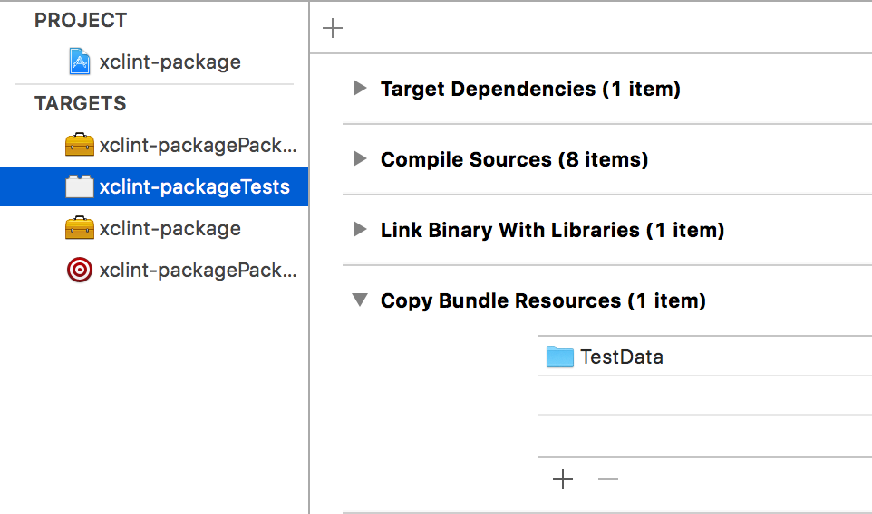

# Xcode Project Linter (xcprojectlint)

## Overview

This project provides a security blanket, ensuring neither your co-workers, nor
git screw up your Xcode project file. Some of the settings are arguably a matter
of personal taste. Fortunately, each option can be enabled separately. `xcprojectlint`
currently supports these checks:

- `build-settings-externalized`

    This mode ensures there are no settings configured at the project level,
    instead encouraging the use of xcconfig files.
    
- `dangling-source-files`
    
    Ensures all source code files are members of a target.

- `disk-layout-matches-project`

    This mode ensures the project references reflect actual file system
    locations. There are some occasions where you may not be able to exactly map
    a folder to disk (Frameworks and Products are common examples). For this,
    there is an additional parameter you can pass: `--skip-folders`, followed by
    a list of folders to ignore.

- `files-exist-on-disk`

    This mode finds file references in the project which are not backed by files.

- `empty-groups`

    This mode reports groups that contain no additional items.

- `items-in-alpha-order`

    This mode ensures the project files and folders are in proper order. 
    There are some occasions where you may not be able to exactly sort items
    in specific folders (Frameworks and Products are common examples). For this,
    there is an additional parameter you can pass: `--skip-folders`, followed by
    a list of folders to ignore.

- `no-white-space-specifications`

    This mode ensures that no file or project contains whitespace specifications of:
    indentWidth, tabWidth, usesTabs, or lineEnding.

- `all`

    For convenience, this mode runs all of the above tests.

When a failing condition is detected, as much useful context as possible is
emitted to `STDOUT`, enabling Xcode to display the errors, in place. Further, it
optionally can return `EX_SOFTWARE`, preventing the build from succeeding until
the problem is addressed.

## Building the Code

To build `xcprojectlint` tool, run

``` bash
$ swift package update
$ make build
```

## Huh? A Makefile?!?

We’re using `make` to hide several shortcomings of the current state of Swift
Package Manager. First off, it has no notion of Resources, which we need for our
unit tests.

``` bash
$ make test
```

to build the test target, copy in the test fixtures, then run the tests.

Second up, the static linking option is documented to be broken, and indeed, it is.

``` bash
$ make release
```

passes the optional arguments that make static linked binaries actually happen.

For completeness, there are also wrappers for `clean` and `build`.

## Debugging in Xcode

If you want to debug from Xcode, you can run `make xcode` to generate the
project file, and then add a Copy Files build phase, configured like this:



## Usage Examples

as a build script phase:

``` bash
bin/xcprojectlint --report error --validations all --project $PROJECT_FILE_PATH
```

as a shell command:

``` bash
xcprojectlint --report error --validations files-exist-on-disk items-in-alpha-order
--project /tmp/Example/Example.xcproject
```

## The Nitty Gritty

`xcprojectlint` is operating on an undocumented file format. Years of looking at broken
git merges has given us a reasonable confidence that we know how the parts all
work together. That said, it is still a best guess, so there may be oversights.
Fortunately, these linting operations are read-only, and will not modify your
project file.

Each run starts by parsing the project file into a series of collections, which
represent our understanding of how a project file is composed. It uses both the
property list structure, and the comments Xcode writes into the project to
assemble its data. Afterwards, xcprojectlint applies validity tests to the extracted
collections, ensuring that the rules specified are met.

## Clues to Fix By

As much as possible, xcprojectlint will attempt to tell you how to locate the problem.
It’ll tell you which build configuration has settings, what the expected order
of a group is, and whatever else it can squeeze out of the available context.
Sometimes, it’ll even tell you the line number in the project file to look at.
This is great, but *do not attempt to view the project within Xcode.* Terrible,
terrible things will happen. Instead, use your favorite text editor to peer
inside.

## The Rules

- Build Settings Externalized

    We iterate all the `BuildConfiguration` blobs, and investigate their
    `BuildSettings` entry. Empty settings are A-OK. Any found settings are in
    error.

- Dangling Source Files

    Iterating through all the source files that appear in the Project Navigator of
    a project file, and ensures all are associated with a target within the same
    project/workspace. Any dangling files found will result in an error. This is
    particularly useful for test files.

- Disk Layout Matches Project

    This test grabs the `MainGroup` out of the project, then recursively
    traverses the children. If the child node is a file, we retrieve the
    `FileReference` by id, then check for a `name` value. The presence of a name
    indicates this file reference does not have a matching file on disk.

- Files Exist on Disk

    This uses a similar recursion to the Layout test, but instead of
    investigating the `name` value, it builds a URL to where the file should
    appear on disk. This is done by assembling the path that led to the file,
    then appending that to a path derived from the project’s path on disk, then
    finally testing for the presence of a file at that location.

- Empty Groups

    One of the simpler tests. We again recurse the `MainGroup`, but this time
    look for entries that have zero children.

- Items in Alpha Order

    We expect our project nodes to contain alphabetized Folders, followed by
    alphabetized files. We check on that by again recursing the groups, and at
    each level sifting the entries into `groupNames`, `fileNames`, and
    `allNames`. We sort the groups and files, contatenate them, then compare
    that to the list of everything.

- No White Space Specifications

    Xcode has a way to, at the user-level, specify custom settings for tabs, spaces,
    indentation amount, and line endings within `Preferences -> Text Editing ->
    Indentation`.  Formatting preferences can also be set at a file or project level,
    altering the experience for team-members if passed through PR unnoticed.  This
    rule aims to alieviate the existence of any whitespace specification and provides
    the appropriate messages for each and their location within the project file.

## Contributing

We welcome your interest in the American Express Open Source Community on Github.
Any contributor to any Open Source Project managed by the American Express Open
Source Community must accept and sign an agreement indicating agreement to the
terms below. Except for the rights granted in this agreement to American Express
and to recipients of software distributed by American Express, You reserve all
right, title, and interest, if any, in and to your contributions. Please [fill
out the agreement](https://cla-assistant.io/americanexpress/xcprojectlint).

Please feel free to open pull requests.  Before submitting a PR, please run your
code through `swiftformat` with the config file provided:
`swiftformat --config swiftformat.config Sources/ Tests/`

## License

Any contributions made under this project will be governed by the [Apache License
2.0](./LICENSE.txt).

## Code of Conduct

This project adheres to the [American Express Community
Guidelines](./CODE_OF_CONDUCT.md).
By participating, you are expected to honor these guidelines.
